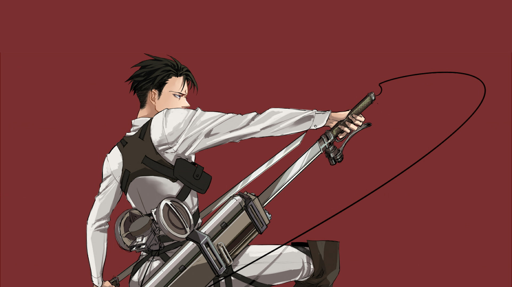

<h2 align="center">I'm SA7 a Delusional Developer, a Knight Hacker</h2>

###

 

  

###

  

###

  
  
  
  
  
  
  
  
  
  
  
  
  
  
  
  
  
  
  
  
  
  
  
  
  
  
  
  
  
  
  
  
  
  
  
  
  
  
  
  
  
  
  

  
  

