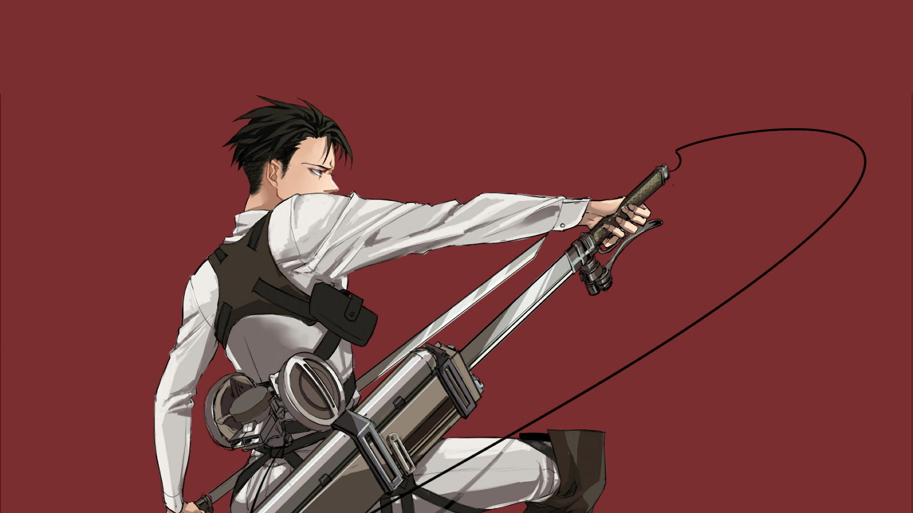

<h2 align="center">I'm SA7 a Delusional Developer, a Knight Hacker</h2>

  

 

  &nbsp;&nbsp;&nbsp;
  &nbsp;&nbsp;&nbsp;
  &nbsp;&nbsp;&nbsp;
  
  
    
  
  &nbsp;&nbsp;&nbsp;
  

  

  
  &nbsp;&nbsp;&nbsp;&nbsp;
  

