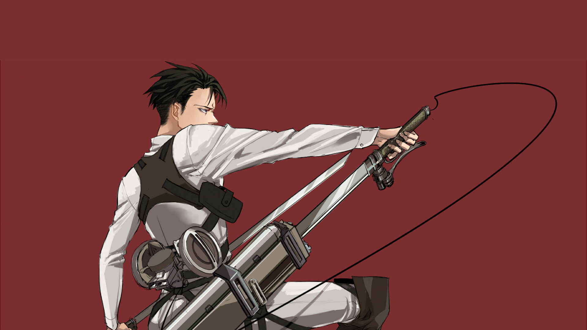

<h2 align="center">I'm SA7 a Delusional Developer, a Knight Hacker</h2>

###

 

  

###

  

###

  &nbsp;&nbsp;&nbsp;
  &nbsp;&nbsp;&nbsp;
  
  
    
  
  &nbsp;&nbsp;&nbsp;
  

    
  </a>
    
  </a>

